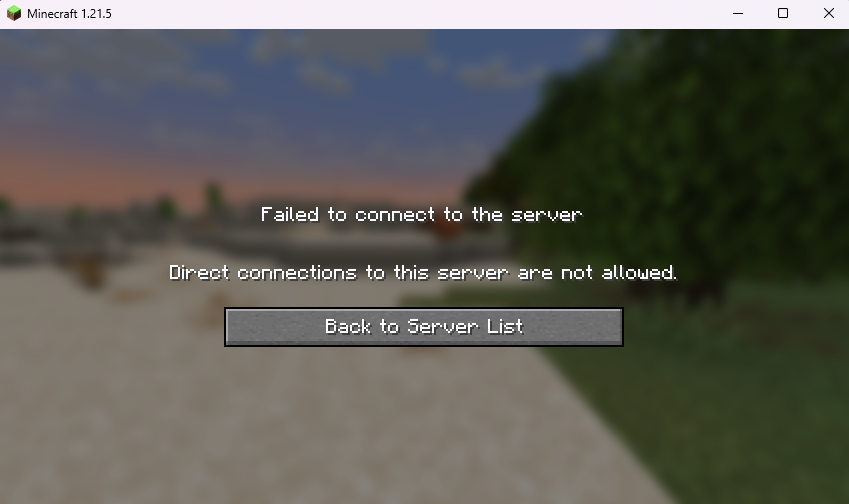

# Enforce Domain
This is a very simple plugin for Velocity that will force players to join over a given domain.

## Installation
Download the latest plugin jar from the release section and place it in the `plugins` directory of your Velocity server.
Then start it up. The plugin will create a configuration file in the `plugins/enforcedomain` directory.

## Configuration
The configuration file is a TOML file and looks like this:
```toml
domains = [
    "example.com",
    "play.example.com"
]

allowLocalhost = false
```

### domains
This is a list of domains that are allowed to connect to the server.  
You can use wildcards in the domain names, e.g. `*.example.com` will allow all subdomains of `example.com`.

### allowLocalhost (default: `false`)
When set to `true`, localhost connections are allowed.
This does also allow using the loopback interface IP address (IPv4 & IPv6) to connect to the server.